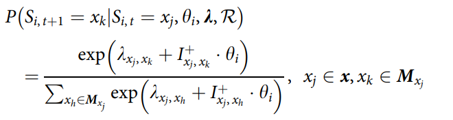

question & self answers:  
1. why all people share same lambda?  
The transition parameter k reflects the characteristics of the task itself, and is independent of the student ability parameter.  
students asked to buy same type ticket.  
1. What determins $I_{ij} = 1\ or\ -1$?  
We define the state transition as the change caused by the students’ operation and all the transitions moving closer to the target state as correct and all the others as incorrect.  
As defined above, according to whether the state transition is on the optimal sequence, we can divide the state transitions into correct transitions (e.g, A ! B and B ! C) and incorrect transitions (e.g., A# and B ! A).    
We denote A, B, and C as the states of the problem and A ! B ! C as the optimal sequence to solve the problem, with the arrows representing the operations that causes the state changes.  
1. Why some 'cancel' transition are correct while others are not?  
some state's 'cancel' transition are closer to the target state while others are not.  
1. Is it true that all state has at most one correct transition? why?  
Yes, choose the cloest one to the target state as the only correct transition.   
but what about two state have same distance?
1. Main Model:  
  
To sum up, we assume that higher ability leads to
a greater probability of taking the correct transition
and lower ability leads to a greater probability of taking the incorrect transition. And the sum of probabilities of all state transitions given a certain state is 1.  
quite like the **1PL irt** model.
